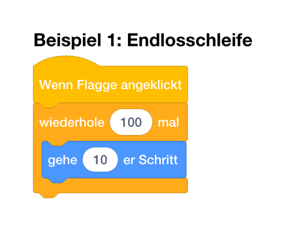
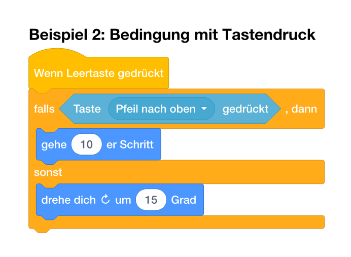
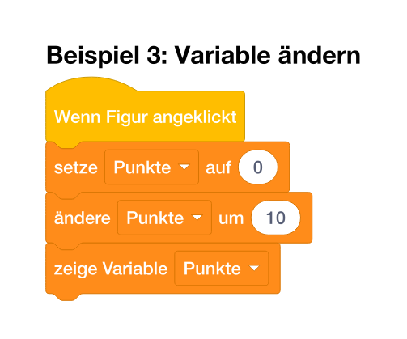
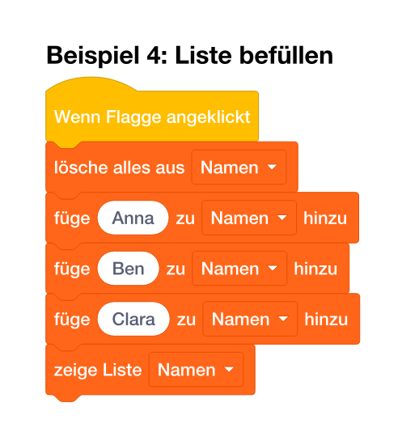
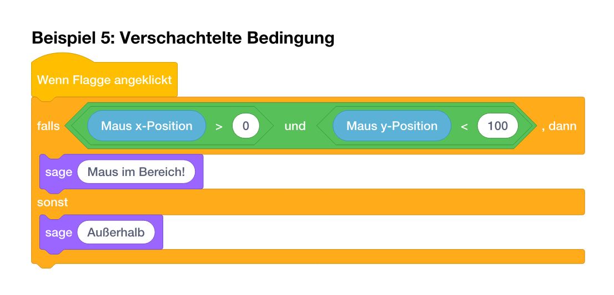
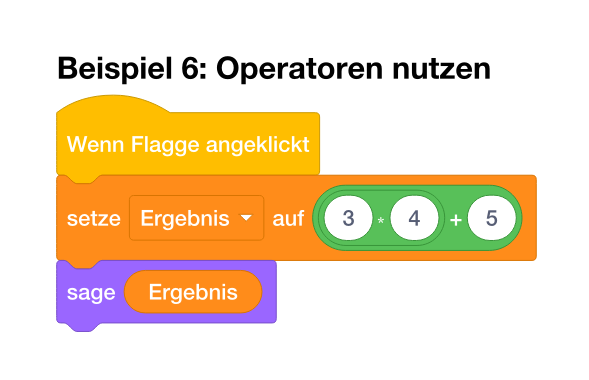
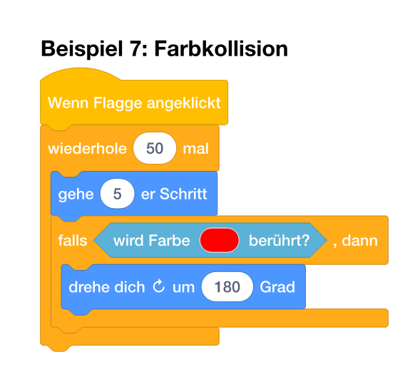
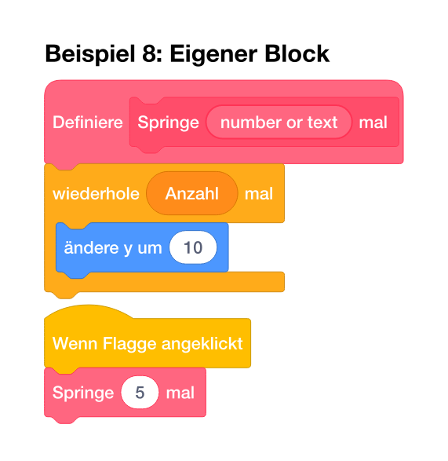

# Blockst – Scratch-Blöcke in Typst

**Blockst** ist ein Typst-Paket, das es ermöglicht, Scratch-Programmierblöcke direkt in Typst-Dokumenten zu erstellen. Perfekt für Programmier-Tutorials, Bildungsmaterialien und Dokumentationen von visuellen Programmierkonzepten.

> **⚠️ Work in Progress**  
> Dieses Projekt befindet sich noch in aktiver Entwicklung. Die Blöcke sind funktional, aber es gibt noch Raum für Verbesserungen bei der pixel-genauen Anpassung an die Original-Scratch-Blöcke. **Hilfe ist herzlich willkommen!** Besonders bei:
> - 🎨 Feintuning der Block-Geometrie und Farben
> - 🌍 Lokalisierung in weitere Sprachen (aktuell: Deutsch & Englisch)
> - 📚 Ergänzung fehlender Blöcke oder Features
> - 🐛 Bug-Reports und Feedback

## Features

- ✅ **Alle Scratch-Kategorien:** Bewegung, Aussehen, Klang, Ereignisse, Steuerung, Fühlen, Operatoren, Variablen, Listen und eigene Blöcke
- ✅ **Originalgetreue Farben:** Normal- und High-Contrast-Modi
- ✅ **Verschachtelte Strukturen:** Schleifen, Bedingungen (falls-dann-sonst), eigene Blöcke
- ✅ **Reporter & Operatoren:** Ovale und runde Pills, Diamant-Bedingungen
- ✅ **Mehrsprachig:** Deutsche und englische Blöcke verfügbar
- ✅ **Moderne API:** Schema-basiertes Rendering mit sauberer Sprachabstraktion

## Installation

Kopiere die Dateien in dein Projekt-Verzeichnis und importiere das Paket:

```typst
#import "lib.typ": blockst, scratch
```

## Schnellstart

### Beispiel 1: Einfache Bewegung

```typst
#blockst[
  #import scratch.de: *
  
  #wenn-gruene-flagge-geklickt[
    #wiederhole(anzahl: 100)[
      #gehe()
    ]
  ]
]
```



### Beispiel 2: Bedingung mit Tastendruck

```typst
#blockst[
  #import scratch.de: *
  
  #wenn-taste-gedrueckt("Leertaste")[
    #falls-sonst(
      taste-gedrueckt("Pfeil nach oben"),
      [#gehe()],
      [#drehe-rechts()],
    )
  ]
]
```



### Beispiel 3: Variablen verwenden

```typst
#blockst[
  #import scratch.de: *
  
  #wenn-diese-figur-angeklickt[
    #setze-variable("Punkte", 0)
    #aendere-variable("Punkte", 10)
    #zeige-variable("Punkte")
  ]
]
```



### Beispiel 4: Listen befüllen

```typst
#blockst[
  #import scratch.de: *
  
  #wenn-gruene-flagge-geklickt[
    #entferne-alles-aus-liste("Namen")
    #fuege-zu-liste-hinzu("Anna", "Namen")
    #fuege-zu-liste-hinzu("Ben", "Namen")
    #fuege-zu-liste-hinzu("Clara", "Namen")
    #zeige-liste("Namen")
  ]
]
```



### Beispiel 5: Verschachtelte Bedingungen

```typst
#blockst[
  #import scratch.de: *
  
  #wenn-gruene-flagge-geklickt[
    #falls-sonst(
      und(
        groesser-als(maus-x(), 0),
        kleiner-als(maus-y(), 100),
      ),
      [#sage-fuer-sekunden("Maus im Bereich!", sekunden: 2)],
      [#sage-fuer-sekunden("Außerhalb", sekunden: 2)],
    )
  ]
]
```



### Beispiel 6: Operatoren verwenden

```typst
#blockst[
  #import scratch.de: *
  
  #wenn-gruene-flagge-geklickt[
    #setze-variable("Ergebnis", addiere(multipliziere(3, 2), 5))
    #sage-fuer-sekunden(eigene-eingabe("Ergebnis"), sekunden: 2)
  ]
]
```



### Beispiel 7: Farbkollision erkennen

```typst
#blockst[
  #import scratch.de: *
  
  #wenn-gruene-flagge-geklickt[
    #wiederhole(anzahl: 50)[
      #gehe()
      #falls(
        wird-farbe-beruehrt(rgb("#FF0000")),
        [#drehe-rechts(grad: 180)],
      )
    ]
  ]
]
```



### Beispiel 8: Eigene Blöcke definieren

```typst
#blockst[
  #import scratch.de: *
  
  #let mein-block = eigener-block("Springe 5 mal")
  
  #definiere(mein-block)[
    #wiederhole(anzahl: 5)[
      #aendere-y(dy: 10)
    ]
  ]
  
  #wenn-gruene-flagge-geklickt[
    #mein-block
  ]
]
```



## API-Übersicht

### Container-Funktion

```typst
#blockst[
  #import scratch.de: *  // Für deutsche Blöcke
  // oder
  #import scratch.en: *  // Für englische Blöcke
  
  // Dein Scratch-Code hier
]
```

### Globale Einstellungen

```typst
#set-blockst(
  theme: "normal",      // oder "high-contrast"
  scale: 100%,          // Skalierung der Blöcke
)
```

## Verfügbare Kategorien

### 🔵 Bewegung (Motion)
- `gehe(schritte: 10)` – Gehe Schritte
- `drehe-rechts(grad: 15)`, `drehe-links(grad: 15)` – Drehe um Grade
- `gehe-zu(x: 0, y: 0)`, `gehe-zu-position(zu)` – Gehe zu Position
- `gleite-zu(sekunden: 1, x: 0, y: 0)` – Gleite zu Position
- `setze-richtung(richtung: 90)`, `drehe-dich-zu(zu)` – Setze Richtung
- `aendere-x(dx: 10)`, `setze-x(x: 0)` – Ändere/Setze X
- `aendere-y(dy: 10)`, `setze-y(y: 0)` – Ändere/Setze Y
- `pralle-vom-rand-ab()` – Pralle vom Rand ab

### 🟣 Aussehen (Looks)
- `sage(nachricht)`, `sage-fuer-sekunden(nachricht, sekunden: 2)` – Sage etwas
- `denke(nachricht)`, `denke-fuer-sekunden(nachricht, sekunden: 2)` – Denke etwas
- `wechsle-zu-kostuem(kostuem)`, `naechstes-kostuem()` – Kostüm wechseln
- `zeige-dich()`, `verstecke-dich()` – Zeige/Verstecke Figur

### 🟡 Ereignisse (Events)
- `wenn-gruene-flagge-geklickt[body]` – Wenn grüne Flagge angeklickt
- `wenn-taste-gedrueckt(taste)[body]` – Wenn Taste gedrückt
- `wenn-diese-figur-angeklickt[body]` – Wenn Figur angeklickt

### 🟠 Steuerung (Control)
- `wiederhole(anzahl: 10)[body]` – Wiederhole n-mal
- `wiederhole-fortlaufend[body]` – Wiederhole fortlaufend
- `falls(bedingung)[body]` – Falls (nur dann)
- `falls-sonst(bedingung, dann, sonst)` – Falls-dann-sonst

### 🔷 Fühlen (Sensing)
- `frage(frage)` – Frage und warte
- `antwort()` – Antwort (Reporter)
- `taste-gedrueckt(taste)` – Taste gedrückt? (Bedingung)
- `maus-x()`, `maus-y()` – Maus-Position (Reporter)
- `wird-beruehrt(objekt)` – Wird berührt? (Bedingung)
- `wird-farbe-beruehrt(farbe)` – Wird Farbe berührt? (Bedingung)

### 🟢 Operatoren (Operators)
- Arithmetik: `addiere(zahl1, zahl2)`, `subtrahiere(zahl1, zahl2)`, `multipliziere(zahl1, zahl2)`, `dividiere(zahl1, zahl2)`
- Vergleiche: `groesser-als(op1, op2)`, `kleiner-als(op1, op2)`, `gleich(op1, op2)`
- Logik: `und(op1, op2)`, `oder(op1, op2)`, `nicht(operand)`
- Text: `verbinde(string1, string2)`, `zeichen-von(position, text)`, `laenge-von(text)`, `enthaelt(text1, text2)`
- Mathematik: `zufallszahl(von: 1, bis: 10)`, `runde(zahl)`, `modulo(zahl1, zahl2)`, `mathematik(operator, zahl)`

### 🟠 Variablen (Variables)
- `setze-variable(variable, wert)` – Setze Variable auf Wert
- `aendere-variable(variable, wert)` – Ändere Variable um Wert
- `zeige-variable(variable)`, `verstecke-variable(variable)` – Zeige/Verstecke Variable
- Reporter: `eigene-eingabe(text)` – Variable als Reporter

### 🟠 Listen (Lists)
- `fuege-zu-liste-hinzu(element, liste)` – Füge zu Liste hinzu
- `entferne-aus-liste(index, liste)` – Entferne aus Liste
- `entferne-alles-aus-liste(liste)` – Lösche alle aus Liste
- `fuege-bei-ein(element, index, liste)` – Füge bei Index ein
- `ersetze-element(index, liste, element)` – Ersetze Element
- Reporter: `element-von-liste(index, liste)`, `nummer-von-element(element, liste)`, `laenge-von-liste(liste)`
- Bedingung: `liste-enthaelt(liste, element)`
- `zeige-liste(liste)`, `verstecke-liste(liste)` – Zeige/Verstecke Liste

### 🩷 Eigene Blöcke (Custom Blocks)

Es gibt zwei Wege, eigene Blöcke zu erstellen:

#### Variante 1: Einfacher Block ohne Parameter
```typst
#blockst[
  #import scratch.de: *
  
  #let mein-block = eigener-block("Springe 5 mal")
  
  #definiere(mein-block)[
    #wiederhole(anzahl: 5)[
      #aendere-y(dy: 10)
    ]
  ]
  
  #wenn-gruene-flagge-geklickt[
    #mein-block
  ]
]
```

#### Variante 2: Block mit mehreren Parametern
```typst
#blockst[
  #import scratch.de: *
  
  #let zeichne = eigener-block("zeichne", (name: "n"), "-Eck in der ", (name: "Größe"))
  
  #definiere(zeichne)[
    #wiederhole(anzahl: parameter("n"))[
      #gehe(schritte: parameter("Größe"))
      #drehe-rechts(grad: dividiere(360, parameter("n")))
    ]
  ]
  
  #wenn-gruene-flagge-geklickt[
    #zeichne(6, 50)  // Sechseck mit Größe 50
    #zeichne(4, 30)  // Viereck mit Größe 30
  ]
]
```

**Verfügbare Funktionen:**
- `eigener-block(...)` – Erstellt einen eigenen Block mit beliebig vielen Parametern
- `definiere(label)[body]` – Definitionsblock für eigene Blöcke
- `parameter(name)` – Liest den Wert eines Parameters im eigenen Block
- `eigene-eingabe(text)` – Variable/Input als Reporter

## Erweiterte Beispiele

Für umfangreichere Beispiele siehe:
- `examples.typ` – Komplexe Algorithmen (Quiz, Bubble Sort, Timer, Polygon-Zeichnung) auf Deutsch
- `examples-short.typ` – Kurze, prägnante Beispiele für alle Kategorien auf Deutsch
- `examples-short-en.typ` – Kurze Beispiele auf Englisch

## Konfiguration

### Theme ändern

```typst
#set-blockst(theme: "high-contrast")  // oder "normal"
```

### Skalierung anpassen

```typst
#set-blockst(scale: 80%)  // Verkleinere auf 80%
```

## Mehrsprachigkeit

Das Paket unterstützt mehrere Sprachen:

```typst
// Deutsche Blöcke
#blockst[
  #import scratch.de: *
  #wenn-gruene-flagge-geklickt[...]
]

// Englische Blöcke
#blockst[
  #import scratch.en: *
  #when-green-flag-clicked[...]
]
```

## Lizenz

Dieses Projekt steht unter der MIT-Lizenz.

## Beitragen

**Beiträge sind herzlich willkommen!** 🎉

Dieses Projekt ist ein Work in Progress, und wir freuen uns über jede Unterstützung:

- 🐛 **Bug-Reports:** Wenn etwas nicht funktioniert oder die Blöcke nicht korrekt dargestellt werden
- 🎨 **Design-Verbesserungen:** Hilf dabei, die Blöcke noch näher an die Original-Scratch-Blöcke anzupassen
- 🌍 **Lokalisierung:** Übersetze die Blöcke in weitere Sprachen
- 📚 **Dokumentation:** Erweitere die Beispiele, schreibe Tutorials oder verbessere die README
- ✨ **Features:** Füge fehlende Blöcke hinzu oder schlage neue Funktionen vor

Erstelle einfach ein Issue oder einen Pull Request auf GitHub!

---

**Erstellt mit ❤️ für die Scratch- und Typst-Community**
