# Blockst - Scratch Blocks in Typst

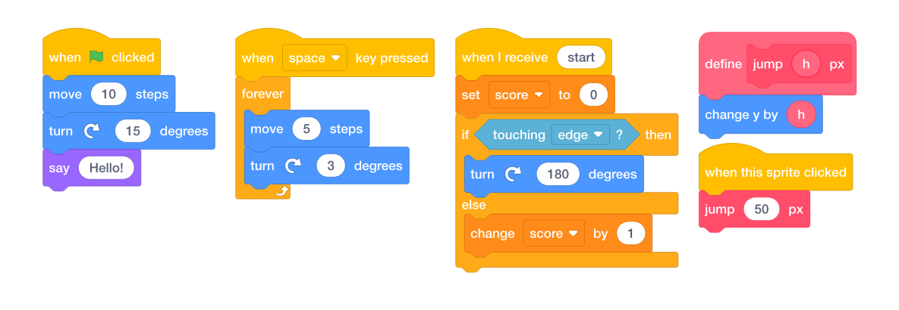

Blockst renders Scratch-style programming blocks directly in Typst documents.
It is made for worksheets, tutorials, teaching material, and visual programming explanations.

## Features

- All major Scratch categories (events, motion, looks, sound, control, sensing, operators, data, custom)
- Nested control structures and custom block definitions
- Reporter/boolean/input pills and monitor widgets
- Three themes: normal, high-contrast, and print (black/white, printer-friendly)
- Localized APIs: English, German, and French
- Optional scratch-run turtle-graphics helpers

## Quick Start

```typst
#import "@preview/blockst:0.2.0": blockst, scratch

#blockst[
  #import scratch.en: *

  #when-flag-clicked[
    #move(steps: 10)
    #say-for-secs("Hello!", secs: 2)
  ]
]
```


## Text Parser: Scratchblocks-Style (EN/DE/FR)

Blockst includes a language-aware scratchblocks-style parser that maps text lines
to visual blocks. Use one of these modules:

- `scratch.text.en`
- `scratch.text.de`
- `scratch.text.fr`

Each module exposes two entry points:

- `render-scratch-text(text)` - parse and render directly
- `parse-scratch-text(text)` - parse only (returns AST-like nodes)

```typst
#import "@preview/blockst:0.2.0": blockst, scratch

#blockst[
  #import scratch.text.en: *

  #render-scratch-text("when flag clicked
repeat 4
move 40 steps
if <touching [mouse-pointer] ?> then
say [Hello parser]
else
turn right 15 degrees
end
end")
]
```

Parser behavior:

- Explicit control flow markers per language:
  - English: `end`, `else`
  - German: `ende`, `sonst`
  - French: `fin`, `sinon`
- Input wrappers are supported: `(number)`, `[text/dropdown]`, `<condition>`
- Nested reporters/booleans are parsed recursively
- Unary math operators like `abs`, `floor`, and `ceiling` are parsed as structured expressions
- Line comments with `//` are ignored by the parser
- Unknown or unsupported lines fail fast with a clear parser error
- Scratch-style dropdown marker text like `[mouse-pointer v]` is accepted and normalized

Examples:

- Scratchblocks parser example: [examples/example-parser-scratchblocks.typ](examples/example-parser-scratchblocks.typ)

To keep parser docs focused and concise, the parser examples in this README use English.

> **Font requirement:** Blockst uses **Helvetica Neue** (the same font Scratch itself uses).
> This font is pre-installed on macOS. On Linux and Windows you need to install it manually,
> or provide a compatible substitute (e.g. *Nimbus Sans* on Linux).
> Without the font, Typst will fall back to a system default and the blocks will look different.
> You can override the font globally with `set-blockst(font: "…")` — see [Custom Font example](#custom-font-set-blockst) below.

## Examples

### Events and Control Flow

```typst
#import "@preview/blockst:0.2.0": blockst, scratch

#set page(width: auto, height: auto, margin: 3mm, fill: white)

#blockst[
  #import scratch.en: *

  #when-flag-clicked[
    #set-variable-to("Score", 0)
    #repeat(times: 5)[
      #move(steps: 10)
      #if-then-else(
        touching-object("edge"),
        turn-right(degrees: 180),
        change-variable-by("Score", 1),
      )
    ]
    #say-for-secs(custom-input("Score"), secs: 2)
  ]
]
```


### Custom Block Definition

```typst
#import "@preview/blockst:0.2.0": blockst, scratch

#set page(width: auto, height: auto, margin: 3mm, fill: white)

#blockst[
  #import scratch.en: *

  #let draw-n-gon = custom-block(
    "draw ",
    (name: "n"),
    "-gon with side length ",
    (name: "s"),
  )

  #define(draw-n-gon, repeat(times: parameter("n"))[
    #move(steps: parameter("s"))
    #turn-right(degrees: divide(360, parameter("n")))
  ])

  #when-flag-clicked[
    #draw-n-gon(6, 40)
    #draw-n-gon(4, 60)
  ]
]
```


### Variable and List Monitors

```typst
#import "@preview/blockst:0.2.0": blockst, scratch

#set page(width: auto, height: auto, margin: 3mm, fill: white)

#blockst[
  #import scratch.en: *

  #when-flag-clicked[
    #set-variable-to("Highscore", 0)
    #add-to-list("Anna", "Players")
    #add-to-list("Ben", "Players")
    #add-to-list("Clara", "Players")
  ]

  // Visual monitors (like on the Scratch stage)
  #variable-display(name: "Highscore", value: 100)

  #list(
    name: "Players",
    items: ("Anna", "Ben", "Clara"),
  )
]
```

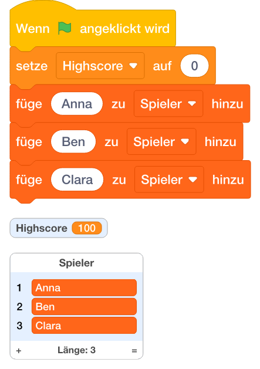

### Inline Usage (without `#blockst`)

`#blockst[]` only adds scaling. Blocks render at 1:1 size in normal document flow — useful for worksheets that mix explanatory text with individual blocks:

```typst
#import "@preview/blockst:0.2.0": scratch

#set page(width: auto, height: auto, margin: 5mm, fill: white)

#import scratch.en: *

*Without `#blockst` — 1:1 scale, place blocks anywhere in layout:*

#grid(
  columns: (auto, auto),
  gutter: 4mm,
  [*Step 1* \ Move the sprite forward.],
  when-flag-clicked[
    #move(steps: 10)
  ],

  [*Step 2* \ Repeat and turn.],
  repeat(times: 4)[
    #move(steps: 50)
    #turn-right(degrees: 90)
  ],
)
```

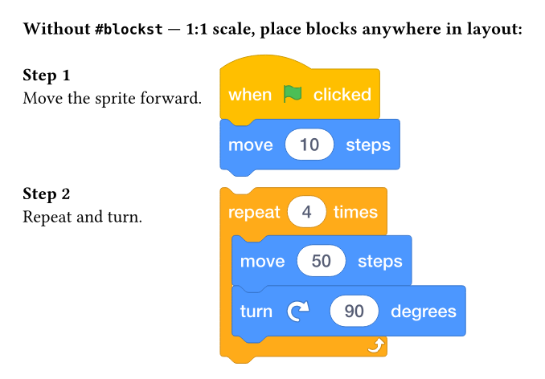

### Content Blocks: When to Use `[...]`

When a branch contains **multiple statements**, wrap them in a content block `[...]`.
When a branch contains only a **single statement**, pass it directly — no `[...]` needed.

```typst
#import "@preview/blockst:0.2.0": blockst, scratch

#set page(width: auto, height: auto, margin: 3mm, fill: white)

#blockst[
  #import scratch.en: *

  #when-flag-clicked[
    #if-then-else(
      touching-object("edge"),
      // Two statements → wrap in [...]
      [
        #turn-right(degrees: 180)
        #move(steps: 10)
      ],
      // Single statement → pass directly, no [...] needed
      change-variable-by("Score", 1),
    )
  ]
]
```

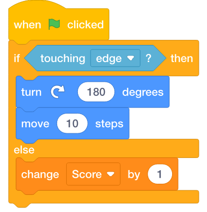

### Scratch-Run (Turtle Graphics)

`scratch-run` executes a list of turtle-graphics commands and renders them onto a canvas.
Import the executable API from `scratch.exec.en` (or `.de`, `.fr`).

```typst
#import "@preview/blockst:0.2.0": blockst, scratch, scratch-run, set-scratch-run

#set page(width: auto, height: auto, margin: 3mm, fill: white)

#import scratch.exec.en: *

// Simple square
#scratch-run(
  pen-down(),
  square(size: 70),
)

// Coloured square spiral — each side grows by 5 units
#set-scratch-run(show-grid: true, show-axes: true, show-cursor: false)

#scratch-run(
  set-pen-color(color: rgb("#4C97FF")),
  set-pen-size(size: 1),
  pen-down(),
  ..for i in range(1, 20) {
    (move(steps: i * 5), turn-right(degrees: 90))
  },
)

#set-scratch-run(show-grid: false, show-axes: false)
```

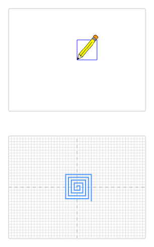

### Theme and Scale (`set-blockst`)

Use `set-blockst` to change the visual theme or scale of all following blocks.
Available themes: `"normal"` (default), `"high-contrast"`, and `"print"`.

```typst
#import "@preview/blockst:0.2.0": blockst, scratch, set-blockst

#set page(width: auto, height: auto, margin: 3mm, fill: white)

// Default: normal theme, 100% scale
#blockst[
  #import scratch.en: *

  #when-flag-clicked[
    #move(steps: 10)
    #say-for-secs("Hello!", secs: 2)
  ]
]

// High-contrast theme at 80% scale
#set-blockst(theme: "high-contrast", scale: 80%)

#blockst[
  #import scratch.en: *

  #when-flag-clicked[
    #move(steps: 10)
    #say-for-secs("Hello!", secs: 2)
  ]
]

// Printer-friendly black/white theme
#set-blockst(theme: "print", scale: 100%)

#blockst[
  #import scratch.en: *

  #when-flag-clicked[
    #move(steps: 10)
    #say-for-secs("Hello!", secs: 2)
  ]
]

// Reset to defaults
#set-blockst(theme: "normal", scale: 100%)
```


### Custom Font (`set-blockst`) {#custom-font-set-blockst}

<details>
<summary><strong>Example: Comic Sans MS</strong></summary>

```typst
#import "@preview/blockst:0.2.0": blockst, scratch, set-blockst

#set page(width: auto, height: auto, margin: 3mm, fill: white)

#set-blockst(font: "Comic Sans MS")

#blockst[
  #import scratch.en: *

  #when-flag-clicked[
    #say-for-secs("Look, Ma — Comic Sans!", secs: 2)
    #repeat(times: 3)[
      #move(steps: 10)
      #turn-right(degrees: 120)
    ]
  ]
]
```


</details>

### German Localization

All block names, labels, and inputs are translated. Here the same control-flow pattern as example 1 in German:

```typst
#import "@preview/blockst:0.2.0": blockst, scratch

#set page(width: auto, height: auto, margin: 3mm, fill: white)

#blockst[
  #import scratch.de: *

  #wenn-gruene-flagge-geklickt[
    #setze-variable("Punkte", 0)
    #wiederhole(anzahl: 5)[
      #gehe(schritte: 10)
      #falls-sonst(
        wird-beruehrt("Rand"),
        drehe-rechts(grad: 180),
        aendere-variable("Punkte", 1),
      )
    ]
    #sage-fuer-sekunden(eigene-eingabe("Punkte"), sekunden: 2)
  ]
]
```


### Container and Settings

```typst
#blockst[ ... ]
#set-blockst(theme: "normal", scale: 100%, stroke-width: 1pt)
```

### Language Modules

```typst
#import scratch.en: *
#import scratch.de: *
#import scratch.fr: *

#import scratch.text.en: *
#import scratch.text.de: *
#import scratch.text.fr: *

#import scratch.sb3: *
```

### scratch-run

```typst
#import "@preview/blockst:0.2.0": scratch-run, set-scratch-run
#import scratch.exec.en: *
```

## Import Scratch `.sb3` via Typst Plugin (WASM)

Recommended workflow:

1. Read `.sb3` bytes with `read(..., encoding: none)`
2. Use helpers from `scratch.sb3`
3. Render imported scripts, lists, and variables directly in Blockst

`scratch.sb3` uses the bundled SB3 plugin by default, so no manual
`plugin("...")` call is needed for standard usage.

### Quick Start

```typst
#import "@preview/blockst:0.2.0": blockst, scratch
#let sb3-bytes = read("project.sb3", encoding: none)

#blockst[
  #import scratch.sb3: render-sb3-scripts
  #render-sb3-scripts(sb3-bytes)
]
```

### Script Rendering Options

```typst
// Render language for labels/headers (same imported SB3 data)
#render-sb3-scripts(sb3-bytes, language: "de")

// Filter by target ("stage" or exact sprite name)
#render-sb3-scripts(sb3-bytes, target: "stage")
#render-sb3-scripts(sb3-bytes, target: "Player")

// Pick one script by global number (1-based across all targets)
#render-sb3-scripts(sb3-bytes, script-number: 2)

// Pick one script by local number inside one selected target
#render-sb3-scripts(sb3-bytes, target: "Player", target-script-number: 1)
```

Header behavior defaults:

- Without `target`: headers are shown
- With `target`: headers are hidden
- Override with `show-headers: true/false`

### Lists and Variables

```typst
#import scratch.sb3: render-sb3-lists, render-sb3-variables

// All lists/variables from one target
#render-sb3-lists(sb3-bytes, target: "stage")
#render-sb3-variables(sb3-bytes, target: "stage")

// Select one item by name (recommended)
#render-sb3-lists(sb3-bytes, target: "stage", target-list-name: "Players")
#render-sb3-variables(sb3-bytes, target: "stage", target-variable-name: "Score")

// Or by local number within the selected target
#render-sb3-lists(sb3-bytes, target: "stage", target-list-number: 1)
#render-sb3-variables(sb3-bytes, target: "stage", target-variable-number: 1)
```

### Catalog APIs (Metadata)

```typst
#import scratch.sb3: sb3-scripts-catalog, sb3-state-catalog

// Script catalog (grouped by target)
#let catalog = sb3-scripts-catalog(sb3-bytes)

// Skip parsed_text for faster metadata-only lookup
#let fast-catalog = sb3-scripts-catalog(sb3-bytes, include-parser-text: false)

// Compact target state snapshots (variables, lists, stage/sprite props)
#let state = sb3-state-catalog(sb3-bytes)
```

### Advanced

You can convert SB3 bytes to parser text directly with `sb3-to-scratch-text(...)`
and optionally pass a custom plugin via `sb3-plugin: plugin("...")`.

If you maintain the SB3 plugin itself, build details are in
[scripts/sb3-wasm/README.md](scripts/sb3-wasm/README.md).

### Validate SB3 Import Coverage

To test whether all opcodes in a specific `.sb3` are currently imported by the
SB3 parser, run:

```bash
./scripts/sb3-wasm/check-sb3-import-coverage.sh examples/Listen.sb3
```

Strict mode (exit with error if unsupported opcodes are found):

```bash
./scripts/sb3-wasm/check-sb3-import-coverage.sh examples/Listen.sb3 --strict
```

## Complete English Block Catalog

<details>
<summary><strong>Events</strong></summary>

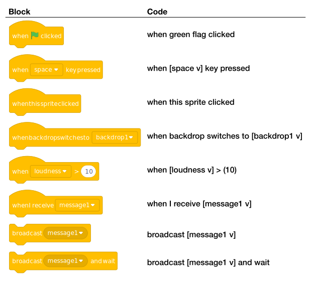

</details>

<details>
<summary><strong>Motion</strong></summary>

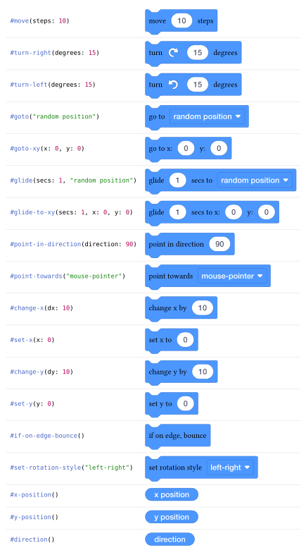

</details>

<details>
<summary><strong>Looks</strong></summary>


</details>

<details>
<summary><strong>Sound</strong></summary>

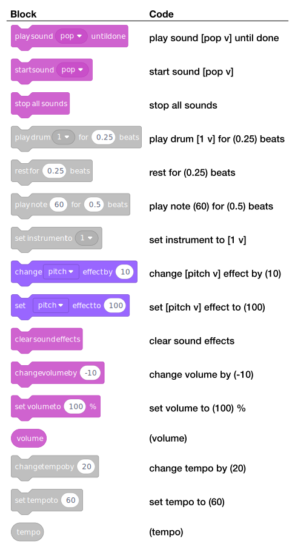

</details>

<details>
<summary><strong>Pen</strong></summary>

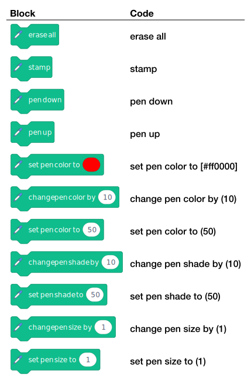

</details>

<details>
<summary><strong>Control</strong></summary>

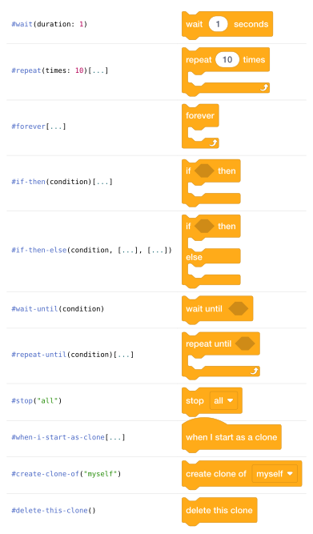

</details>

<details>
<summary><strong>Sensing</strong></summary>

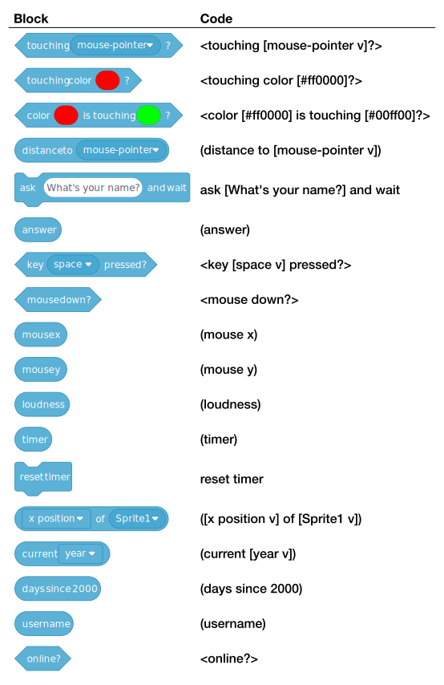

</details>

<details>
<summary><strong>Operators</strong></summary>


</details>

<details>
<summary><strong>Variables</strong></summary>

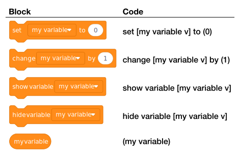

</details>

<details>
<summary><strong>Lists</strong></summary>

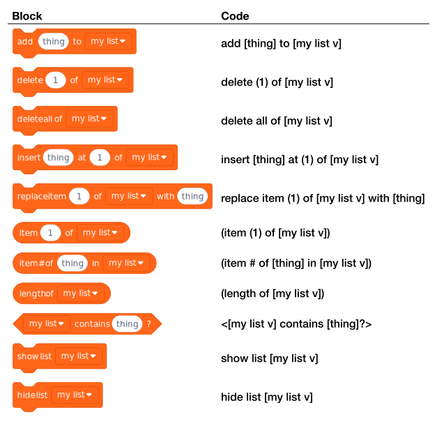

</details>

<details>
<summary><strong>Custom Blocks</strong></summary>

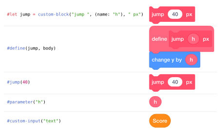

</details>

## Contributing

Contributions are welcome: bug reports, missing blocks, API polish, docs, and new localizations.
