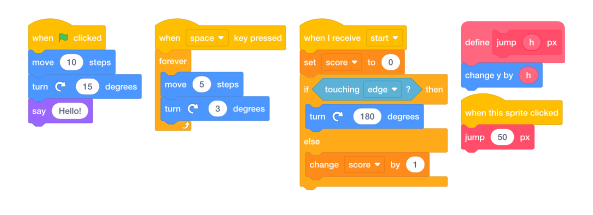
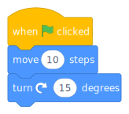
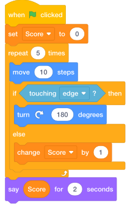
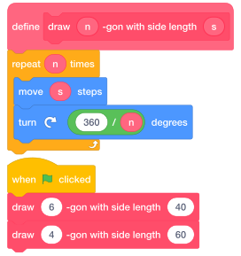
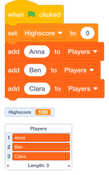
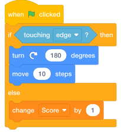
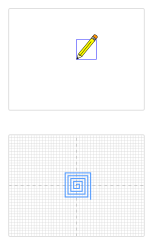
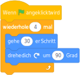
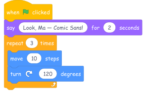
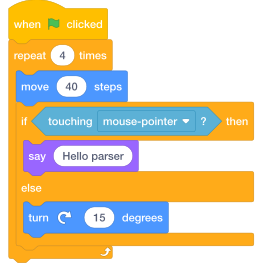

# Blockst - Scratch Blocks in Typst

<p align="left">
  <a href="https://typst.app/universe/package/blockst"></a>
  <a href="LICENSE"></a>
</p>



Blockst renders Scratch-style programming blocks directly in Typst documents.
It is made for worksheets, tutorials, teaching material, and visual programming explanations.

## Contents

- [Highlights](#highlights)
- [Install and Import](#install-and-import)
- [Quick Start](#quick-start)
- [Example Gallery](#example-gallery)
- [Parser Scratchblocks Style](#parser-scratchblocks-style)
- [SB3 Import via Typst Plugin WASM](#sb3-import-via-typst-plugin-wasm)
- [Complete English Block Catalog](#complete-english-block-catalog)
- [Contributing](#contributing)

## Highlights

- All major Scratch categories (events, motion, looks, sound, control, sensing, operators, data, custom)
- Nested control structures and custom block definitions
- Reporter, boolean, input pills and monitor widgets
- Themes: normal, high-contrast, print
- Localized APIs: English, German, French
- Optional scratch-run turtle graphics helpers
- SB3 import helpers for scripts, lists, variables, and catalogs
- SB3 image import (PNG, JPEG, SVG) and static screen preview

## Install and Import

```typst
#import "@preview/blockst:0.2.0": blockst, scratch
```

> Font requirement: Blockst is designed for Helvetica Neue (Scratch-like look).
> On Linux/Windows install a compatible font (for example Nimbus Sans),
> or override globally with `set-blockst(font: "...")`.

## Quick Start



<details>
<summary><strong>Show code</strong></summary>

```typst
#import "@preview/blockst:0.2.0": blockst, scratch

#blockst[
  #import scratch.en: *

  #when-flag-clicked[
    #move(steps: 10)
    #say-for-secs("Hello!", secs: 2)
  ]
]
```

</details>

Source: [examples/example-quickstart.typ](examples/example-quickstart.typ)

## Example Gallery

All long snippets below use the same pattern: result first, code in a collapsible block.

### Events and Control Flow



<details>
<summary><strong>Show code</strong></summary>

```typst
#import "@preview/blockst:0.2.0": blockst, scratch

#set page(width: auto, height: auto, margin: 3mm, fill: white)

#blockst[
  #import scratch.en: *

  #when-flag-clicked[
    #set-variable-to("Score", 0)
    #repeat(times: 5)[
      #move(steps: 10)
      #if-then-else(
        touching-object("edge"),
        turn-right(degrees: 180),
        change-variable-by("Score", 1),
      )
    ]
    #say-for-secs(custom-input("Score"), secs: 2)
  ]
]
```

</details>

Source: [examples/example-en.typ](examples/example-en.typ)

### Custom Block Definition



<details>
<summary><strong>Show code</strong></summary>

```typst
#import "@preview/blockst:0.2.0": blockst, scratch

#set page(width: auto, height: auto, margin: 3mm, fill: white)

#blockst[
  #import scratch.en: *

  #let draw-n-gon = custom-block(
    "draw ",
    (name: "n"),
    "-gon with side length ",
    (name: "s"),
  )

  #define(draw-n-gon, repeat(times: parameter("n"))[
    #move(steps: parameter("s"))
    #turn-right(degrees: divide(360, parameter("n")))
  ])

  #when-flag-clicked[
    #draw-n-gon(6, 40)
    #draw-n-gon(4, 60)
  ]
]
```

</details>

Source: [examples/example-custom.typ](examples/example-custom.typ)

### Variable and List Monitors



<details>
<summary><strong>Show code</strong></summary>

```typst
#import "@preview/blockst:0.2.0": blockst, scratch

#set page(width: auto, height: auto, margin: 3mm, fill: white)

#blockst[
  #import scratch.en: *

  #when-flag-clicked[
    #set-variable-to("Highscore", 0)
    #add-to-list("Anna", "Players")
    #add-to-list("Ben", "Players")
    #add-to-list("Clara", "Players")
  ]

  #variable-display(name: "Highscore", value: 100)

  #list(
    name: "Players",
    items: ("Anna", "Ben", "Clara"),
  )
]
```

</details>

Source: [examples/example-monitors.typ](examples/example-monitors.typ)

### Inline Usage Without blockst Container


<details>
<summary><strong>Show code</strong></summary>

```typst
#import "@preview/blockst:0.2.0": scratch

#set page(width: auto, height: auto, margin: 5mm, fill: white)

#import scratch.en: *

#grid(
  columns: (auto, auto),
  gutter: 4mm,
  [*Step 1* \ Move the sprite forward.],
  when-flag-clicked[
    #move(steps: 10)
  ],

  [*Step 2* \ Repeat and turn.],
  repeat(times: 4)[
    #move(steps: 50)
    #turn-right(degrees: 90)
  ],
)
```

</details>

Source: [examples/example-inline.typ](examples/example-inline.typ)

### Content Blocks with if then else



<details>
<summary><strong>Show code</strong></summary>

```typst
#import "@preview/blockst:0.2.0": blockst, scratch

#set page(width: auto, height: auto, margin: 3mm, fill: white)

#blockst[
  #import scratch.en: *

  #when-flag-clicked[
    #if-then-else(
      touching-object("edge"),
      [
        #turn-right(degrees: 180)
        #move(steps: 10)
      ],
      change-variable-by("Score", 1),
    )
  ]
]
```

</details>

Source: [examples/example-if.typ](examples/example-if.typ)

### Scratch Run Turtle Graphics



<details>
<summary><strong>Show code</strong></summary>

```typst
#import "@preview/blockst:0.2.0": blockst, scratch, scratch-run, set-scratch-run

#set page(width: auto, height: auto, margin: 3mm, fill: white)
#import scratch.exec.en: *

#scratch-run(
  pen-down(),
  square(size: 70),
)

#set-scratch-run(show-grid: true, show-axes: true, show-cursor: false)

#scratch-run(
  set-pen-color(color: rgb("#4C97FF")),
  set-pen-size(size: 1),
  pen-down(),
  ..for i in range(1, 20) {
    (move(steps: i * 5), turn-right(degrees: 90))
  },
)
```

</details>

Source: [examples/example-run.typ](examples/example-run.typ)

### Theme and Scale


<details>
<summary><strong>Show code</strong></summary>

```typst
#import "@preview/blockst:0.2.0": blockst, scratch, set-blockst

#set page(width: auto, height: auto, margin: 3mm, fill: white)

#blockst[
  #import scratch.en: *

  #when-flag-clicked[
    #move(steps: 10)
    #say-for-secs("Hello!", secs: 2)
  ]
]

#v(4mm)

#set-blockst(theme: "high-contrast", scale: 80%)

#blockst[
  #import scratch.en: *

  #when-flag-clicked[
    #move(steps: 10)
    #say-for-secs("Hello!", secs: 2)
  ]
]

#v(4mm)

#set-blockst(theme: "print", scale: 100%)

#blockst[
  #import scratch.en: *

  #when-flag-clicked[
    #move(steps: 10)
    #say-for-secs("Hello!", secs: 2)
  ]
]

#set-blockst(theme: "normal", scale: 100%)
```

</details>

Source: [examples/example-theme.typ](examples/example-theme.typ)

### Localizations and Fonts

#### German Localization



<details>
<summary><strong>Show code</strong></summary>

```typst
#import "@preview/blockst:0.2.0": blockst, scratch

#set page(width: auto, height: auto, margin: 3mm, fill: white)

#blockst[
  #import scratch.de: *

  #wenn-gruene-flagge-geklickt[
    #setze-variable("Punkte", 0)
    #wiederhole(anzahl: 5)[
      #gehe(schritte: 10)
      #falls-sonst(
        wird-beruehrt("Rand"),
        drehe-rechts(grad: 180),
        aendere-variable("Punkte", 1),
      )
    ]
    #sage-fuer-sekunden(eigene-eingabe("Punkte"), sekunden: 2)
  ]
]
```

</details>

Source: [examples/example-de.typ](examples/example-de.typ)

#### Custom Font



<details>
<summary><strong>Show code</strong></summary>

```typst
#import "@preview/blockst:0.2.0": blockst, set-blockst, scratch

#set page(width: auto, height: auto, margin: 3mm, fill: white)

#set-blockst(font: "Comic Sans MS")

#blockst[
  #import scratch.en: *

  #when-flag-clicked[
    #say-for-secs("Look, Ma — Comic Sans!", secs: 2)
    #repeat(times: 3)[
      #move(steps: 10)
      #turn-right(degrees: 120)
    ]
  ]
]
```

</details>

Source: [examples/example-font.typ](examples/example-font.typ)

## Parser Scratchblocks Style



API on language modules:

- `render-text(text)` parses and renders directly
- `parse-text(text)` parses only and returns structured nodes

<details>
<summary><strong>Show parser code</strong></summary>

```typst
#import "@preview/blockst:0.2.0": blockst, scratch

#blockst[
  #import scratch.en: *

  #render-text("
    when flag clicked
      repeat (4)
        move (40) steps
        if <touching [mouse-pointer] ?> then
          say [Hello parser]
        else
          turn right (15) degrees
        end
      end
  ")
]
```

</details>

Source: [examples/example-parser-scratchblocks.typ](examples/example-parser-scratchblocks.typ)

## SB3 Import via Typst Plugin WASM

Recommended workflow:

1. Read `.sb3` as bytes via `read(..., encoding: none)`
2. Import one language module (`scratch.en`, `scratch.de`, `scratch.fr`)
3. Render scripts, lists, variables, images, or screen preview

### SB3 Quick Start

<details>
<summary><strong>Show code</strong></summary>

```typst
#import "@preview/blockst:0.2.0": blockst, scratch
#let sb3-bytes = read("Mampf-Matze Lösung.sb3", encoding: none)

#blockst[
  #import scratch.de: *
  #sb3-scripts(sb3-bytes)
]
```

</details>

### SB3 API at a Glance

- Scripts: `sb3-scripts(...)` with target/script filters
- Lists: `sb3-lists(...)` by target, name, or local index
- Variables: `sb3-variables(...)` by target, name, or local index
- Images: `sb3-images-catalog(...)`, `sb3-image(...)`
- Screen: `sb3-screen-preview(...)`
- Catalogs: `scratch.sb3.sb3-scripts-catalog(...)`, `scratch.sb3.sb3-state-catalog(...)`

### Mampf Matze Screen Example

Result and code: [examples/example-screen-mampfmatze.svg](examples/example-screen-mampfmatze.svg) | [examples/example-screen-mampfmatze.typ](examples/example-screen-mampfmatze.typ)

### Validate SB3 Import Coverage

```bash
./scripts/sb3-wasm/check-sb3-import-coverage.sh "examples/Mampf-Matze Lösung.sb3"
./scripts/sb3-wasm/check-sb3-import-coverage.sh "examples/Mampf-Matze Lösung.sb3" --strict
```

## Complete English Block Catalog

<details>
<summary><strong>Events</strong></summary>


</details>

<details>
<summary><strong>Motion</strong></summary>


</details>

<details>
<summary><strong>Looks</strong></summary>


</details>

<details>
<summary><strong>Sound</strong></summary>


</details>

<details>
<summary><strong>Pen</strong></summary>


</details>

<details>
<summary><strong>Control</strong></summary>


</details>

<details>
<summary><strong>Sensing</strong></summary>


</details>

<details>
<summary><strong>Operators</strong></summary>


</details>

<details>
<summary><strong>Variables</strong></summary>


</details>

<details>
<summary><strong>Lists</strong></summary>


</details>

<details>
<summary><strong>Custom Blocks</strong></summary>


</details>

## Contributing

Contributions are welcome: bug reports, missing blocks, API polish, docs, and new localizations.
