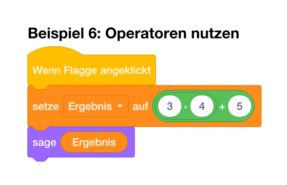
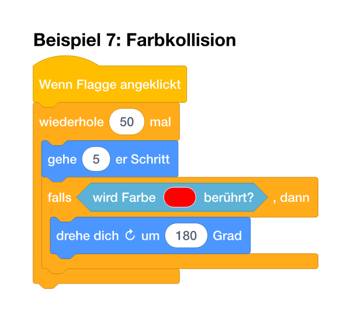
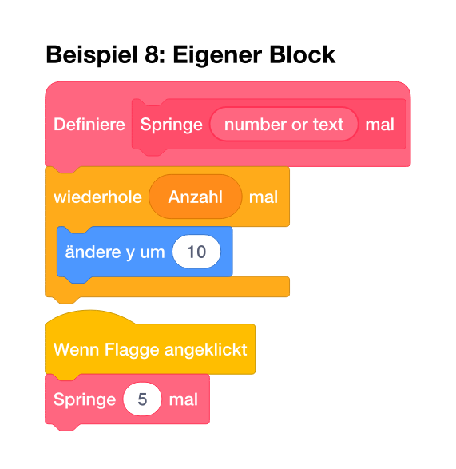

Voici la traduction complète en français, en conservant la structure, le format et les blocs de code :

---

# Blockst – Blocs Scratch dans Typst

**Blockst** est un paquet Typst qui permet de créer directement des blocs de programmation Scratch dans des documents Typst. Parfait pour les tutoriels de programmation, les supports pédagogiques et la documentation de concepts de programmation visuelle.

> **⚠️ Travail en cours**
> Ce projet est encore en développement actif. Les blocs sont fonctionnels, mais il reste une marge d’amélioration pour un ajustement au pixel près par rapport aux blocs Scratch originaux. **Toute aide est la bienvenue !** En particulier pour :
>
> * 🎨 l’affinage de la géométrie et des couleurs des blocs
> * 🌍 la localisation dans d’autres langues (actuellement : allemand, anglais et français)
> * 📚 l’ajout de blocs ou de fonctionnalités manquants
> * 🐛 les rapports de bugs et les retours d’expérience

## Fonctionnalités

* ✅ **Toutes les catégories Scratch** : Mouvement, Apparence, Son, Événements, Contrôle, Capteurs, Opérateurs, Variables, Listes, Stylo et blocs personnalisés
* ✅ **Couleurs fidèles à l’original** : modes normal et contraste élevé et impression
* ✅ **Structures imbriquées** : boucles, conditions (si–alors–sinon), blocs personnalisés
* ✅ **Reporters et opérateurs** : pastilles ovales et rondes, conditions en losange
* ✅ **Multilingue** : blocs disponibles en allemand, en anglais et en français
* ✅ **API moderne** : rendu basé sur des schémas avec une abstraction linguistique propre

## Installation

Copiez les fichiers dans le répertoire de votre projet et importez le paquet :

```typst
#import "lib.typ": blockst, scratch
```

## Démarrage rapide

### Exemple 1 : Mouvement simple

```typst
#blockst[
  #import scratch.de: *
  
  #wenn-gruene-flagge-geklickt[
    #wiederhole(anzahl: 100)[
      #gehe()
    ]
  ]
]
```


### Exemple 2 : Condition avec appui sur une touche

```typst
#blockst[
  #import scratch.de: *
  
  #wenn-taste-gedrueckt("Leertaste")[
    #falls-sonst(
      taste-gedrueckt("Pfeil nach oben"),
      [#gehe()],
      [#drehe-rechts()],
    )
  ]
]
```


### Exemple 3 : Utiliser des variables

```typst
#blockst[
  #import scratch.de: *
  
  #wenn-diese-figur-angeklickt[
    #setze-variable("Punkte", 0)
    #aendere-variable("Punkte", 10)
    #zeige-variable("Punkte")
  ]
]
```


### Exemple 4 : Remplir des listes

```typst
#blockst[
  #import scratch.de: *
  
  #wenn-gruene-flagge-geklickt[
    #entferne-alles-aus-liste("Namen")
    #fuege-zu-liste-hinzu("Anna", "Namen")
    #fuege-zu-liste-hinzu("Ben", "Namen")
    #fuege-zu-liste-hinzu("Clara", "Namen")
    #zeige-liste("Namen")
  ]
]
```


### Exemple 5 : Conditions imbriquées

```typst
#blockst[
  #import scratch.de: *
  
  #wenn-gruene-flagge-geklickt[
    #falls-sonst(
      und(
        groesser-als(maus-x(), 0),
        kleiner-als(maus-y(), 100),
      ),
      [#sage-fuer-sekunden("Maus im Bereich!", sekunden: 2)],
      [#sage-fuer-sekunden("Außerhalb", sekunden: 2)],
    )
  ]
]
```


### Exemple 6 : Utiliser des opérateurs

```typst
#blockst[
  #import scratch.de: *
  
  #wenn-gruene-flagge-geklickt[
    #setze-variable("Ergebnis", addiere(multipliziere(3, 2), 5))
    #sage-fuer-sekunden(eigene-eingabe("Ergebnis"), sekunden: 2)
  ]
]
```



### Exemple 7 : Détecter une collision de couleur

```typst
#blockst[
  #import scratch.de: *
  
  #wenn-gruene-flagge-geklickt[
    #wiederhole(anzahl: 50)[
      #gehe()
      #falls(
        wird-farbe-beruehrt(rgb("#FF0000")),
        [#drehe-rechts(grad: 180)],
      )
    ]
  ]
]
```



### Exemple 8 : Définir des blocs personnalisés

```typst
#blockst[
  #import scratch.de: *
  
  #let mein-block = eigener-block("Springe 5 mal")
  
  #definiere(mein-block)[
    #wiederhole(anzahl: 5)[
      #aendere-y(dy: 10)
    ]
  ]
  
  #wenn-gruene-flagge-geklickt[
    #mein-block
  ]
]
```



## Aperçu de l’API

### Fonction conteneur

```typst
#blockst[
  #import scratch.de: *  // Pour les blocs en allemand
  // ou
  #import scratch.en: *  // Pour les blocs en anglais
  // ou
  #import scratch.fr: *  // Pour les blocs en français
  
  // Ton code Scratch ici
]
```

### Paramètres globaux

```typst
#set-blockst(
  theme: "normal",      // ou "high-contrast" ou "print"
  scale: 100%,          // Mise à l’échelle des blocs
)
```

## Catégories disponibles

### 🔵 Mouvement (Motion)

* `gehe(schritte: 10)` – Avancer de n pas
* `drehe-rechts(grad: 15)`, `drehe-links(grad: 15)` – Tourner de n degrés
* `gehe-zu(x: 0, y: 0)`, `gehe-zu-position(zu)` – Aller à une position
* `gleite-zu(sekunden: 1, x: 0, y: 0)` – Glisser vers une position
* `setze-richtung(richtung: 90)`, `drehe-dich-zu(zu)` – Définir la direction
* `aendere-x(dx: 10)`, `setze-x(x: 0)` – Modifier / définir X
* `aendere-y(dy: 10)`, `setze-y(y: 0)` – Modifier / définir Y
* `pralle-vom-rand-ab()` – Rebondir sur le bord

### 🟣 Apparence (Looks)

* `sage(nachricht)`, `sage-fuer-sekunden(nachricht, sekunden: 2)` – Dire quelque chose
* `denke(nachricht)`, `denke-fuer-sekunden(nachricht, sekunden: 2)` – Penser quelque chose
* `wechsle-zu-kostuem(kostuem)`, `naechstes-kostuem()` – Changer de costume
* `zeige-dich()`, `verstecke-dich()` – Montrer / cacher le sprite

### 🟡 Événements (Events)

* `wenn-gruene-flagge-geklickt[body]` – Quand le drapeau vert est cliqué
* `wenn-taste-gedrueckt(taste)[body]` – Quand une touche est pressée
* `wenn-diese-figur-angeklickt[body]` – Quand ce sprite est cliqué

### 🟠 Contrôle (Control)

* `wiederhole(anzahl: 10)[body]` – Répéter n fois
* `wiederhole-fortlaufend[body]` – Répéter indéfiniment
* `falls(bedingung)[body]` – Si (alors)
* `falls-sonst(bedingung, dann, sonst)` – Si–alors–sinon

### 🔷 Capteurs (Sensing)

* `frage(frage)` – Poser une question et attendre
* `antwort()` – Réponse (reporter)
* `taste-gedrueckt(taste)` – Touche pressée ?
* `maus-x()`, `maus-y()` – Position de la souris
* `wird-beruehrt(objekt)` – Touche un objet ?
* `wird-farbe-beruehrt(farbe)` – Touche une couleur ?

### 🟢 Opérateurs (Operators)

* Arithmétique : `addiere`, `subtrahiere`, `multipliziere`, `dividiere`
* Comparaisons : `groesser-als`, `kleiner-als`, `gleich`
* Logique : `und`, `oder`, `nicht`
* Texte : `verbinde`, `zeichen-von`, `laenge-von`, `enthaelt`
* Mathématiques : `zufallszahl`, `runde`, `modulo`, `mathematik`

### 🟠 Variables (Variables)

* `setze-variable`, `aendere-variable` – Définir / modifier une variable
* `zeige-variable`, `verstecke-variable` – Afficher / masquer une variable
* Reporter : `eigene-eingabe`

### 🟠 Listes (Lists)

* `fuege-zu-liste-hinzu` – Ajouter à une liste
* `entferne-aus-liste`, `entferne-alles-aus-liste` – Supprimer
* `fuege-bei-ein`, `ersetze-element` – Insérer / remplacer
* Reporters : `element-von-liste`, `nummer-von-element`, `laenge-von-liste`
* Condition : `liste-enthaelt`
* `zeige-liste`, `verstecke-liste` – Afficher / masquer la liste

### 🩷 Blocs personnalisés (Custom Blocks)

Il existe deux façons de créer des blocs personnalisés :

#### Variante 1 : Bloc simple sans paramètres

*(exemple inchangé)*

#### Variante 2 : Bloc avec plusieurs paramètres

*(exemple inchangé)*

**Fonctions disponibles :**

* `eigener-block(...)` – Crée un bloc personnalisé
* `definiere(label)[body]` – Bloc de définition
* `parameter(name)` – Lire un paramètre
* `eigene-eingabe(text)` – Entrée / variable comme reporter

## Exemples avancés

Pour des exemples plus complets, voir :

* `examples.typ` – Algorithmes complexes (quiz, tri à bulles, minuteur, dessin de polygones) en allemand
* `examples-short.typ` – Exemples courts pour toutes les catégories (allemand)
* `examples-short-en.typ` – Exemples courts en anglais

## Configuration

### Changer le thème

```typst
#set-blockst(theme: "high-contrast")  // ou "normal"
```

### Ajuster l’échelle

```typst
#set-blockst(scale: 80%)  // Réduire à 80 %
```

## Multilinguisme

Le paquet prend en charge plusieurs langues :

```typst
// Blocs en allemand
#blockst[
  #import scratch.de: *
  #wenn-gruene-flagge-geklickt[...]
]

// Blocs en anglais
#blockst[
  #import scratch.en: *
  #when-green-flag-clicked[...]
]
// Blocs en français
#blockst[
  #import scratch.fr: *
  #when-green-flag-clicked[...]
  // ou
  #quand-drapeau[...]
```

## Licence

Ce projet est distribué sous licence MIT.

## Contribuer

**Les contributions sont les bienvenues !** 🎉

Ce projet est un travail en cours, et toute aide est appréciée :

* 🐛 **Rapports de bugs**
* 🎨 **Améliorations de design**
* 🌍 **Localisation** dans d’autres langues
* 📚 **Documentation**
* ✨ **Fonctionnalités** supplémentaires

Il suffit de créer une issue ou une pull request sur GitHub !

---

**Créé avec ❤️ pour la communauté Scratch et Typst**
